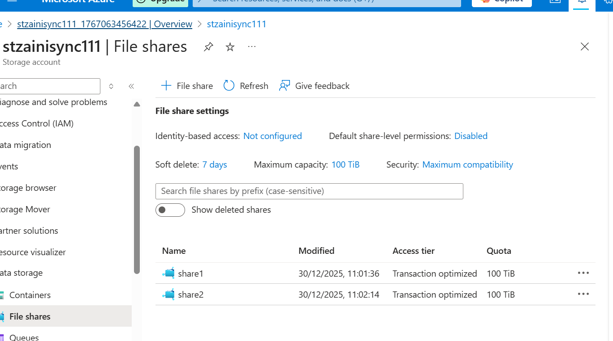
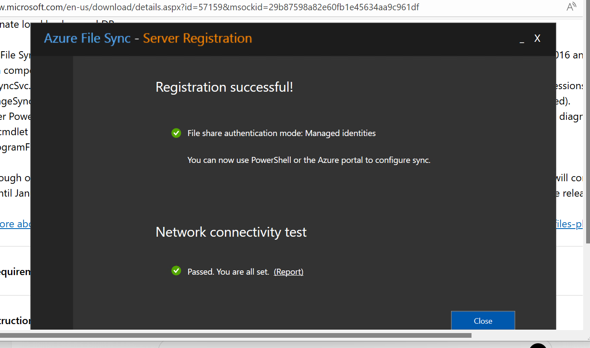
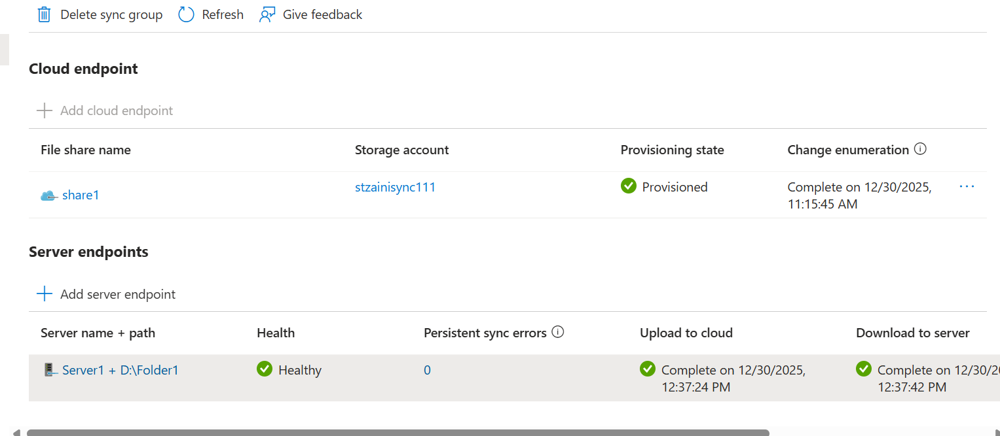
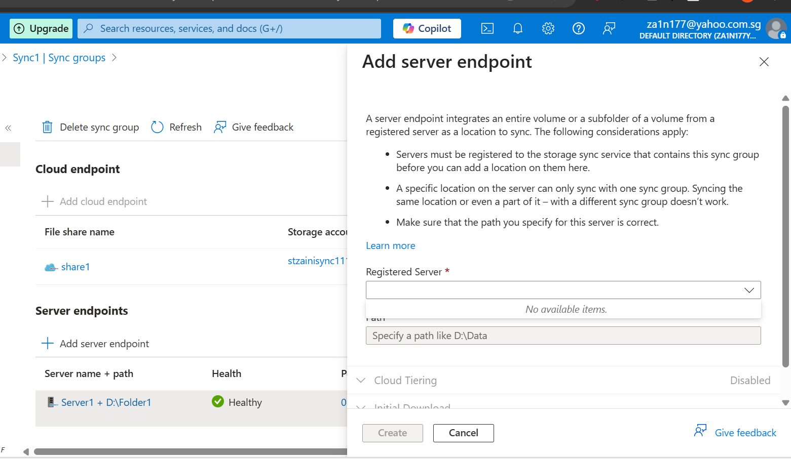
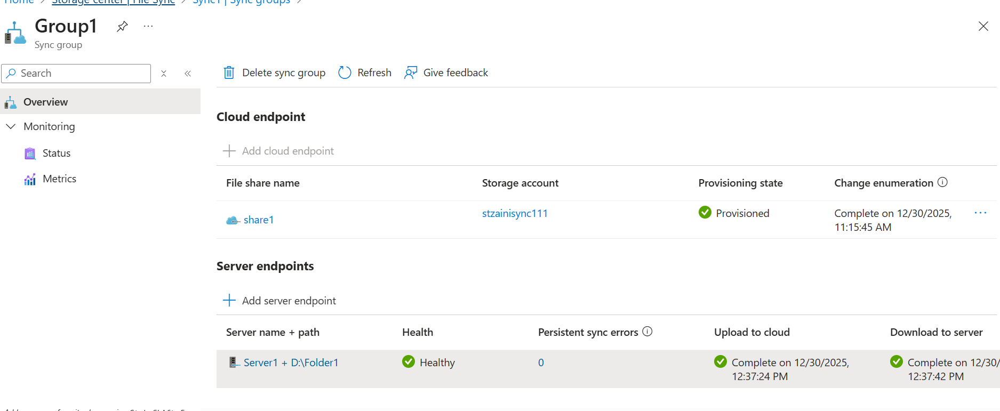

# 📘 AZ-104 Lab – Azure File Sync Constraints (Question 111)

**Exam:** Microsoft AZ-104 – Azure Administrator

---

## 🧠 Objective
Validate **Azure File Sync architectural constraints** commonly tested in the AZ-104 exam by reproducing them in a real Azure environment.

This lab focuses on platform-enforced behaviors rather than theoretical concepts.

---

## 🧪 Lab Scenario

- One Azure Storage Account
- Two Azure File Shares: `share1`, `share2`
- One Storage Sync Service
- One Sync Group
- One Windows Server (`Server1`)

---

## 🛠️ Azure Resources Used
- Azure Storage Account (Standard, LRS)
- Azure File Shares
- Azure Storage Sync Service
- Azure File Sync Agent
- Azure Windows Server VM (Server1)

## 🧩 Skills Demonstrated
- Azure File Sync architecture
- Storage Sync Service configuration
- Cloud endpoint and server endpoint constraints
- Azure Windows Server integration
- AZ-104 exam scenario validation

---

## 🔹 Step 1 – Create Azure File Shares

Two file shares (`share1`, `share2`) were created in the same storage account.

---

## 🔹 Step 2 – Create Sync Group with Cloud Endpoint

A sync group was created using `share1` as the cloud endpoint.

**Observed behavior:**  
Azure blocks additional cloud endpoints.

> **Rule:** A sync group supports **only one cloud endpoint (Azure file share)**.

---

## 🔹 Step 3 – Register Windows Server

The Azure File Sync agent was installed on Windows Server and registered successfully.

---

## 🔹 Step 4 – Add First Server Endpoint (Success)

`Server1 + D:\Folder1` was added and reached **Healthy** state.

---

## 🔹 Step 5 – Attempt Second Server Endpoint (Blocked)

Azure prevented adding a second server endpoint from the same server by removing it from the selectable list.

> **Rule:** A server can have **only one server endpoint per sync group**.

---

## 🔹 Final State

- One cloud endpoint
- One server endpoint
- No sync errors

---

## ✅ AZ-104 Exam Takeaways
- One sync group → **one cloud endpoint**
- One server → **one server endpoint per sync group**
- Multiple folders from the same server require **separate sync groups**
- Azure File Sync supports **Windows Server only**

---

## 🎯 Why This Lab Matters
This lab demonstrates **platform-enforced limits**, which is exactly how AZ-104 questions are designed.

---
**Disclaimer:** This lab is for learning and portfolio purposes only and does not include real exam questions or answers.
